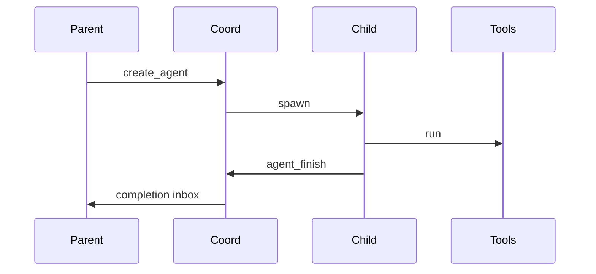

# Sequence (mermaid 备用 · 待 Archify render)

```mermaid
sequenceDiagram
  Parent->>Coord: create_agent
  Coord->>Child: spawn
  Child->>Tools: run
  Child->>Coord: agent_finish
  Coord->>Parent: completion inbox
```
