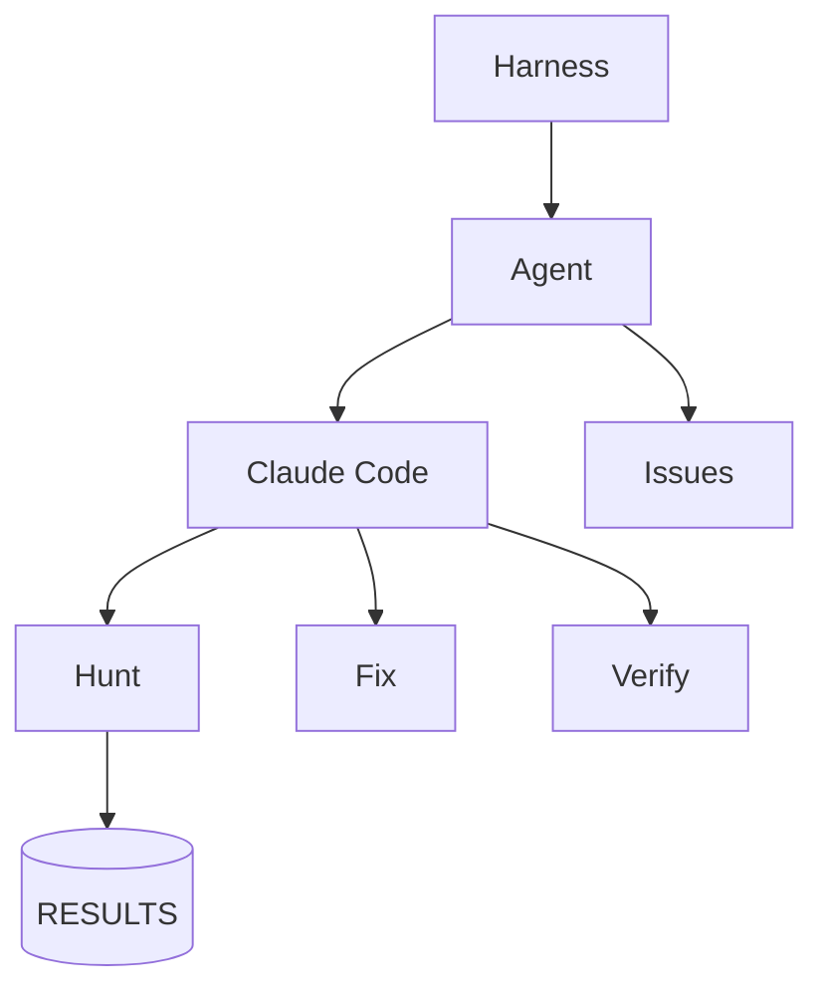

# Architecture (mermaid 备用 · 待 Archify render)

```mermaid
flowchart TB
  Harness --> Agent --> CC[Claude Code]
  CC --> Hunt
  CC --> Fix
  CC --> Verify
  Hunt --> Out[(RESULTS)]
  Agent --> GH[Issues]
```
