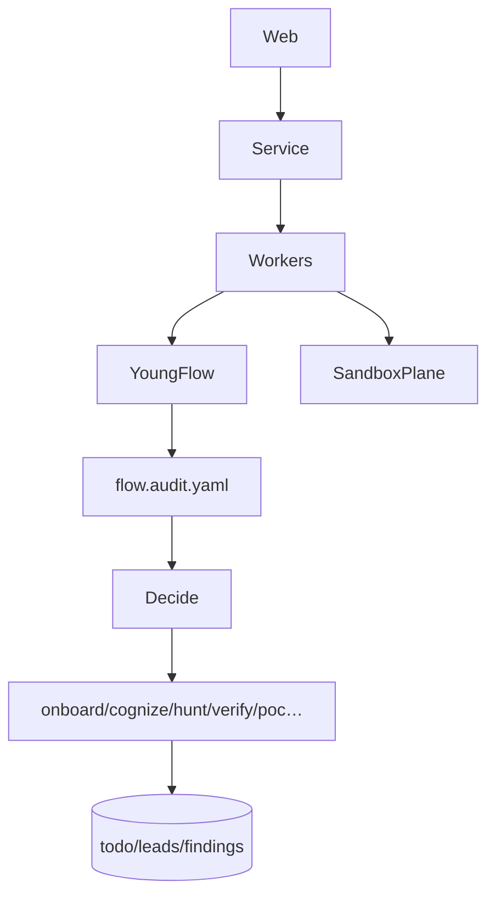

# Architecture (mermaid 备用 · Clouditera 纠偏)

> 源仓库已纠偏为 Clouditera/VulnHunter + YoungFlow；Archify HTML 若未重渲，以本文件与 code-*-mermaid 为准。

```mermaid
flowchart TB
  Web --> Service --> Workers
  Workers --> YoungFlow
  YoungFlow --> VulnForge[flow.audit.yaml]
  VulnForge --> Decide
  Decide --> Stages[onboard/cognize/hunt/verify/poc…]
  Stages --> Workspace[(todo/leads/findings)]
  Workers --> SandboxPlane
```
