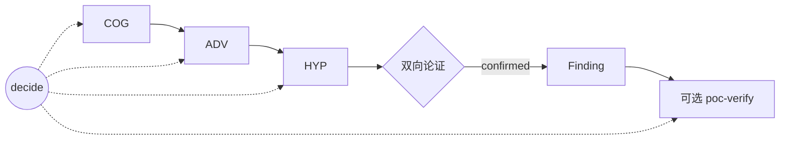

# Dataflow (mermaid 备用 · Clouditera 纠偏)

```mermaid
flowchart LR
  COG --> ADV --> HYP
  HYP --> Verify{双向论证}
  Verify -->|confirmed| Finding
  Finding --> POC[可选 poc-verify]
  Decide((decide)) -.-> COG & ADV & HYP & POC
```
