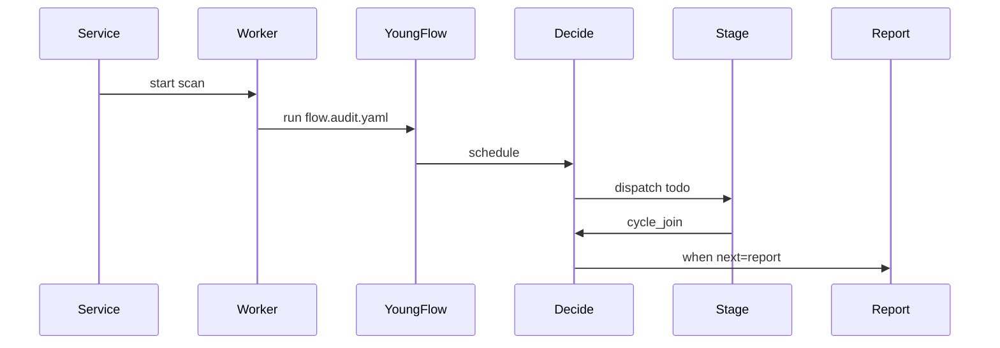

# Sequence (mermaid 备用 · Clouditera 纠偏)

```mermaid
sequenceDiagram
  Service->>Worker: start scan
  Worker->>YoungFlow: run flow.audit.yaml
  YoungFlow->>Decide: schedule
  Decide->>Stage: dispatch todo
  Stage->>Decide: cycle_join
  Decide->>Report: when next=report
```
